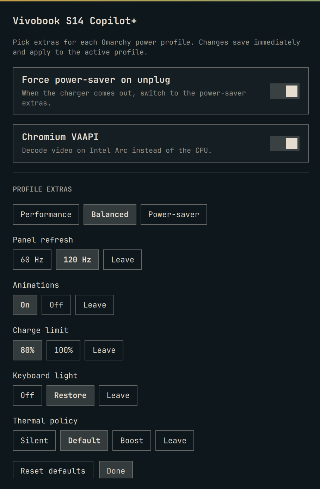
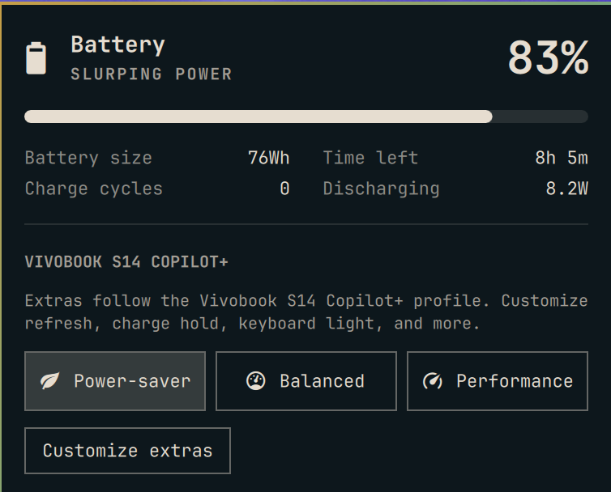

# Vivobook S14 Copilot+

Omarchy shell plugin for the **ASUS Vivobook S14 Copilot+** (S5406SA,
Intel Core Ultra 7 258V, Arc 130V/140V, 2880×1800@120 panel).

Plugin id: `vivobook.s14-copilot`



It does not edit `/usr/share/omarchy`. It watches power-profiles-daemon and
the AC adapter, then applies Vivobook S14 Copilot+ extras on top of the
stock Omarchy power profiles.



## Install

From git:

```sh
omarchy plugin add https://github.com/paulogeyer/omarchy-vivobook-s14-copilot.git --enable
```

From a local checkout:

```sh
omarchy plugin add "$HOME/Projects/omarchy-vivobook-s14-copilot" --enable --yes
```

`--enable` loads the background tuner **and** puts this plugin's power widget
on the bar (same battery icon, profile buttons, plus **Customize extras**).
Disable or remove stock `omarchy.power` / a local `pg.power` clone so you do
not get two battery icons. Profile buttons call `bin/apply`; unplug/plug still
works with the panel closed.

Charge hold needs a **separate package** so the plugin never runs as root.
Install it, then 80%/100% is passwordless and restored at boot:

```sh
git clone https://github.com/paulogeyer/vivobook-s14-copilot-charge.git
cd vivobook-s14-copilot-charge
makepkg -si
```

See [vivobook-s14-copilot-charge](https://github.com/paulogeyer/vivobook-s14-copilot-charge).

Open **Customize extras** from the power panel, or:

```sh
omarchy-shell vivobook.s14-copilot open '{}'
```

Choices are saved to `~/.config/omarchy/vivobook-s14-copilot.json`.

The profile CLI is `bin/omarchy-vivobook-profile` (calls `bin/apply`).

On this machine the canonical git tree is
`~/Projects/omarchy-vivobook-s14-copilot`;
`~/.config/omarchy/plugins/vivobook.s14-copilot` is a symlink to it.

## What each profile does

| Bar button | PPD | Panel | Animations | Charge | Keyboard | ASUS thermal |
|---|---|---|---|---|---|---|
| Performance | performance | 120 Hz | on | 100% | restored | overboost (1) |
| Balanced | balanced | 120 Hz | on | 80% | restored | default (0) |
| Power-saver | power-saver | 60 Hz | off | 80% | off | silent (2) |

Unplugging forces **power-saver**. Plug back in and Omarchy restores the last
AC profile; this plugin reapplies matching extras. Set
`OMARCHY_VIVOBOOK_AUTO_BATTERY=0` to leave the last battery PPD alone.

Chromium VAAPI flags are turned on if they are missing (Arc decode). Bluetooth
is not touched.

## Extra knobs this machine actually has

- Session: Hyprland `hl.monitor` / `animations` via `hyprctl eval` (Lua parser).
- Keyboard backlight via `brightnessctl` on `asus::kbd_backlight`.
- Charge hold at `BAT0/charge_control_end_threshold` via
  `/usr/lib/vivobook-s14-copilot/set-charge-limit` (package
  `vivobook-s14-copilot-charge`). The plugin only calls that fixed path with
  `sudo -n`. The pack does not drain down to 80%; the limit only stops
  further charging.
- Best-effort `asus-nb-wmi` `throttle_thermal_policy` if sysfs is writable.
- power-profiles-daemon already drives Intel P-state EPP and ACPI platform
  profile. TLP is not used (it conflicts with PPD).

Wi-Fi power save and PCI runtime PM need root and are skipped rather than
prompting on every unplug.

## Files

- `bin/apply` — tuner used by the service and by a cloned power menu
- Charge helper package: [vivobook-s14-copilot-charge](https://github.com/paulogeyer/vivobook-s14-copilot-charge)
- `bin/omarchy-vivobook-profile` — CLI for profiles, VAAPI, and cleanup
- `bin/config` — merge defaults with the user JSON
- `Service.qml` — watches UPower + PPD, and hosts the customize overlay
- `images/` — customize overlay and power menu screenshots

```bash
~/.config/omarchy/plugins/vivobook.s14-copilot/bin/apply status
~/.config/omarchy/plugins/vivobook.s14-copilot/bin/apply balanced
~/.config/omarchy/plugins/vivobook.s14-copilot/bin/apply setup
~/.config/omarchy/plugins/vivobook.s14-copilot/bin/omarchy-vivobook-profile status
~/.config/omarchy/plugins/vivobook.s14-copilot/bin/omarchy-vivobook-profile battery
```

## Remove

```sh
sudo pacman -R vivobook-s14-copilot-charge
omarchy plugin remove vivobook.s14-copilot
```

## License

MIT. See [LICENSE](LICENSE).
